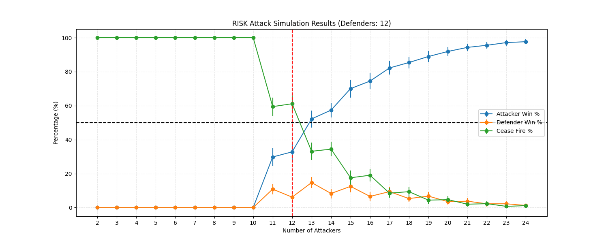

# Risk Analysis In Risk

A set of scripts to run a Monte Carlo simulation of battles between armies of different sizes (n attackers vs m defenders) in the game RISK, to develop an attack strategy before real world gameplay, and determine the probability of attacker success in any given situation.

These scripts are designed to run on a laptop, or on a Spark cluster.
Designed to be submitted as a Spark job via the [Cluster Management MCP](https://github.com/Jcardenas34/cluster_management_MCP/tree/main).

# Motivation
This Monte Carlo simulator allows the user to develop an understanding of the win/lose/draw landscape with different army sizes before entering an engagement, allowing the user to develop an attack strategy and manage risk in their gameplay.

# Key Insight
Interestingly, by running thousands of battle simulations with different defending and attacking army sizes, I have found that if an attacker adopts a strategy to attack with an army size of +2 relative to the defending army, and to continue attacking so long as the attacker's army count does not fall below the defender's army count - 1 , an attacker consistently has an advantage (>50% probability of defeating an opposing army) in battles between armies of 4 and 24. With an even larger advantage 60-65% for a +3 army advantage.

## Stack

- **Simulation:** Python, PySpark
- **Execution:** Laptop (single-node) or Spark cluster (distributed)
- **Monitoring:** Submittable via MCP server with Prometheus/Grafana 
  observability
